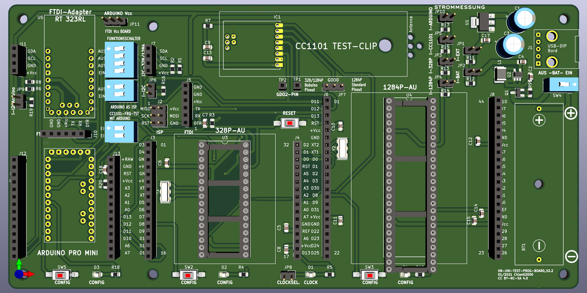
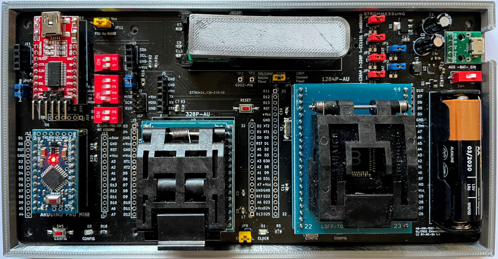

# HB-UNI-TEST-PROG-BOARD 

Eine Platine zum Programmieren des ARDUINO PRO MINI und der AVR 328P-AU /1284P-AU sowie für den Frequenztest /Frequenzpairing der programmierten AVR mit dem CC1101 Funkmodul. 

Ich möchte hier mein Programmier- und Testboard für den Arduino Pro Mini, 328P-AU und 1284P-AU und kompatible mit TQFP-32 und -44 Sockel vorstellen.
Ausgangspunkt war die HB-CC01-Testbench von Tom. Da aber immer mehr User AVR-Chips bei ihren Selbstbauprojekten einsetzen, ist sicher auch hier der Bedarf für eine Programmier- und Testbench vorhanden. 

## HB-UNI-TEST-PROG-BOARD_V1.2

Im ersten Schritt bestand die folgende Zielsetzung bezüglich der Funktionalität:

- [ ] Programmierboard für 328P-AU bzw. 1284P-AU und kompatible. Der Anschluss über ISP bzw. FTDI ist möglich.

- [ ] Testboard für den Frequenztest /Frequenzkorrektur des CC1101 in Verbindung mit 328P-AU bzw. 1284P-AU, so daß der CC1101 mit dem angepassten AVR-Chip später direkt gemeinsam "verbaut" werden kann.

- [ ] Weiterentwicklung der "Testklemme" mit POGO-Pins von Toms Testbench  https://github.com/TomMajor/SmartHome/tree/master/HB-CC1101-Testbench zur Testklammer zum schnelleren /einfacheren CC1101 Tausch. Herausführen des GDO2-Pins als Möglichkeit für den Anschluss eines Oszillators.

- [ ] Spannungsversorgung über Batteriezelle AA und Wandler auf 3,3 V oder USB-Anschluss mit Spannungsregler 3,3V. Der USB Buchsen Typ kann über ein aufgelötetes USB-DIP Board nach eigenen Wünschen gewählt werden. Vorwahl der Einspeisung über Jumper, hier kann bei Bedarf auch der Gesamtstrom gemessen werden. Das CLOCK-Signal kann über den Jumper CLOCKSEL deaktiviert werden um die Strommessung nicht zu verfälschen.

- [ ] Möglichkeit der Strommessung getrennt für Gesamtstrom (I-BAT bzw. I.EXT), I-328P-AU,            I-1284P-AU, I-CC1101 und I-I2C. Die Shunt- Widerstände können bei Bedarf bestückt oder weggelassen werden.

- [ ] Funktions- bzw. Programmtest der Schaltung der AVR-Chip sowie Messung der Stromaufnahme im "Real-Betrieb" über:
  - den am vorgesehenen I2C-Anschluss angeschlossenen Messmodulen (Strommessung      I-I2C bei Bedarf über Jumperklemme möglich).
  - Anschluss von Bauteilen bzw. eines Breadboard an den 1:1 auf die Buchsenleisten herausgeführten Anschlüssen der AVR-Chips .

Der Sockel für den 1284P-AU wurde entsprechend dem BOBUINO-Pinout beschriftet und verschaltet. Die Umstellung Bobuino- auf Standard-Pinout für die Ansteuerung GD00-PIN des CC1101 ist über einen Jumper vorgesehen. Somit können auch Programme mit Standard-Pinout im Zusammenspiel mit dem CC1101 getestet werden. Im Programm ist nur der PIN für die CONFIG-LED  anzupassen.

Für den Frequenztest mit Standard-Pinout ist trotzdem ein anderer Sketch als für den "klassischen" Test mit Bobuino-Pinout notwendig. Ich habe beide Varianten unter FILES abgelegt.  

### Bilder
</img>

### Schemata
https://github.com/chianti2000/00-SmartHome/blob/main/PCB/HB-UNI-TEST-PROG-BOARD/FILES/Schema_HB-UNI-TEST-PROG-BOARD_V1.2.pdf

## HB-UNI-TEST-PROG-BOARD_V2.2

In einer zweiten Variante wurde das  HB-UNI-TEST-PROG-BOARD um eine Testbench für den Arduino Pro Mini mit den o.g. Funktionalitäten erweitert.

Der Arduino Pro Mini kann sowohl über den FTDI-Adapter als auch über den ISP programmiert werden. Im Fall des ISP ist ein setzen der FUSES und aufspielen eines neuen Bootloaders des Arduino Pro Mini möglich.

Als Nebeneffekt kann über den verbauten FTDI-Adapter direkt auf den FTDI-Anschluss des Boards zum Hochladen bzw. als serieller Monitor zugegriffen werden. Wenn man den Arduino Pro Mini als ISP programmiert, kann er als ISP-Programmer für die AVR-Chips auf den Sockel genutzt werden.

### Bilder
</img></img></img>

### Schemata
https://github.com/chianti2000/00-SmartHome/blob/main/PCB/HB-UNI-TEST-PROG-BOARD/FILES/Schema%20HB-UNI-TEST-PROG-BOARD_V2.2.pdf

### Funktionen

## Testklammer für CC1101

Als Weiterentwicklung der Testklemme von Toms Testbench https://github.com/TomMajor/SmartHome/tree/master/HB-CC1101-Testbench ist zum schnelleren Wechsel des CC1101 diese Testklammer entstanden.

### Bilder

## Links

https://github.com/TomMajor/SmartHome/tree/master/HB-CC1101-Testbench

https://github.com/pa-pa/AskSinPP/tree/master/examples/FreqTest

## Lizenz

**Creative Commons BY-NC-SA**
Give Credit, NonCommercial, ShareAlike

This work is licensed under a [Creative Commons Attribution-NonCommercial-ShareAlike 4.0 International License](http://creativecommons.org/licenses/by-nc-sa/4.0/).
